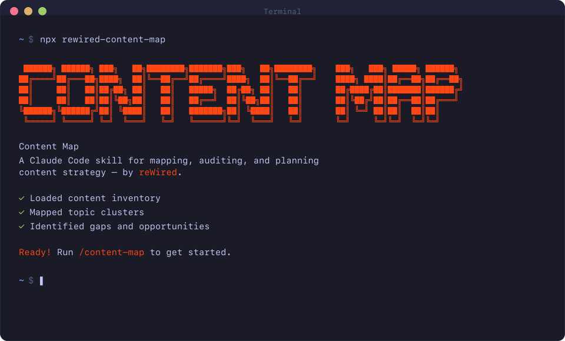

<div align="center">



### CONTENT MAP SKILL
**A Claude Code skill for content strategists and digital marketers.**

*See before you build.*

<br>

&nbsp;&nbsp;

<br>

`/content-map` &nbsp;·&nbsp; `/content-map-setup`

</div>

---

## What this is

A Claude Code slash command skill that maps your full content program before you make a single production decision. It maps every asset to a funnel stage, flags what is gated and invisible to Google and AI, scores each page against EEAT and AEO frameworks, identifies where the funnel breaks, and delivers a prioritized action plan — all before recommending a single new piece of content.

It connects directly to GA4, Google Search Console, and Semrush to pull live data. It crawls pages with WebFetch for EEAT and AEO scoring. It runs keyword gap analysis against approved competitors with two guardrail gates before any cluster expansion. And it includes a standalone Content Map mode for mapping an entire resource library to funnel stages and identifying what to build or reposition.

This is not a content creation tool. It is a content diagnosis tool.

---

## Why it was built

Most content teams produce without a clear picture of what they already have, what is performing, what is invisible, and where the funnel breaks. The typical workflow is: write more, publish more, hope it works.

The Content Map Skill flips that. Before any new content gets produced, you need to see clearly:

- What exists and where it sits in the funnel
- What is gated and therefore invisible to Google and AI answer engines
- What is ranking but not converting, or visible but not ranking
- Where competitors are capturing keyword clusters you are not covering
- Which assets are failing EEAT or AEO quality thresholds
- What gaps can be filled by repositioning existing assets before writing anything new

Production is the last resort. This skill makes that principle actionable.

---

## Who this is for

- **Content strategists** who manage a content program and want to understand what is actually working before making production decisions
- **Digital marketers** focused on organic search and AI answer engine visibility
- **SEO practitioners** who want to integrate behavioral signal (GA4) and visibility signal (Search Console) with quality scoring (EEAT/AEO) in a single workflow
- **Solo operators and small teams** running a content program without a large agency or dedicated analytics function
- **Anyone who has been told to "create more content"** and wants to understand why the existing content is not converting first

---

## Version highlights

**v2.0** — AskUserQuestion interactive entry points (Full inventory / Search Console / Single asset diagnostic); user intent taxonomy (Know/Evaluate/Do) added to funnel mapping with mismatch flagging; GEO (Generative Engine Optimization) added as third evaluation framework in Layer 6 alongside EEAT and AEO; YMYL flag for healthcare, finance, and legal domains; AEO chunk density check (200–400 word section standard); zero-click framing (59% of searches end without a click); AEO + GEO readiness summary table in Layer 9 output; Layer 7 citation approval via AskUserQuestion per citation. Version.txt corrected from stale 1.3 to 2.0.

**v1.5** — Added memory/learning system (`content-map-memory.json`); research mode for gap recommendations (explicit permission, citation blocks with Approve/Reject/Replace); internal linking architecture added to Layer 9 output and single asset diagnostic.

**v1.4** — Renamed from Content Visibility Audit to Content Map. Updated slash commands to `/content-map` and `/content-map-setup`. Added Content Remix Skill to `bonus/` folder.

**v1.3** — Config path consistency fixes across Competitor Selection Gate and Layer 10; Keyword Gate 1 now runs in Content Map Mode before Gate 2, matching the full two-gate keyword workflow from Layer 5.

**v1.2** — Added Competitor Selection Gate (interactive, always-confirmed, three options); Layer 10 Content Map Mode (nine-step standalone strategic workflow); 3-mode return launch (Rerun / Single asset / Content map); version check on every launch with silent update notification.

**v1.1** — Output folder rule; context isolation rule; GA4 MCP connection option; WebFetch-based EEAT/AEO scoring; scale handling for large inventories; Layer 9 report saving; multi-domain config support.

**v1.0** — Initial release. Nine-layer audit framework, two-phase onboarding, EEAT + AEO scoring, competitor gap analysis, repurposing layer, MOFU-first prioritization.

Full history: [CHANGELOG.md](CHANGELOG.md)

---

## Install

### Mac / Linux

```bash
mkdir -p ~/.claude/commands && curl -fsSL https://raw.githubusercontent.com/drew-rewired/content-map/main/content-map-skill.md -o ~/.claude/commands/content-map.md
```

Restart Claude Code. Onboarding starts automatically on next launch.

---

### Windows

```powershell
curl.exe -fsSL https://raw.githubusercontent.com/drew-rewired/content-map/main/content-map-skill.md -o "$env:USERPROFILE\.claude\commands\content-map.md"
```

---

### Manual

[**Download content-map-skill.md →**](https://raw.githubusercontent.com/drew-rewired/content-map/main/content-map-skill.md) *(right-click → Save As)*

Place the file in:
- **Mac / Linux**: `~/.claude/commands/`
- **Windows**: `%USERPROFILE%\.claude\commands\`

Restart Claude Code. Onboarding starts automatically.

---

## Getting started

**First launch:** Onboarding begins automatically — no slash command needed. You are walked through two phases:

1. **Technical connections** — GA4, Google Search Console, Semrush, competitor domains. All optional except your domain. If GA4 is connected via Claude MCP, just say "MCP" to skip manual configuration.
2. **Brand configuration** — Primary audience, ICP, brand voice, content goals, off-limits topics, and a free-text additional context field.

The only required answer is your domain. Everything else is optional — skipped steps are flagged and setup keeps moving.

Configuration saves to `content-map/{domain}/content-map-config.json` in your working directory.

**After setup:** Type `/content-map` to begin. To update your configuration at any time, type `/content-map-setup`.

---

## How it works

### On first run

Type `/content-map` after setup completes. The skill pulls your full content inventory from Search Console (first), GA4 (fallback), or a manual URL list (last resort). Then it runs all nine layers in sequence.

### On return launches

You are presented with three modes:

| Mode | What it does |
|---|---|
| **Rerun** | Full re-map with fresh data from all connected sources |
| **Single asset diagnostic** | Drop in one URL or PDF — runs Layers 1–6 scoped to that asset, with Layers 7–8 adapted to surface improvement opportunities for the single asset |
| **Content map** | Maps your resource library to funnel stages, identifies gaps, produces keyword-backed recommendations |

Type `/content-map` at any point to skip the menu and go straight to a full map.

---

## The nine map layers

| Layer | What it does |
|---|---|
| 1. Content inventory | Builds the asset list from Search Console → GA4 → manual upload, in that order |
| 2. Funnel mapping | Assigns every asset to TOFU, MOFU, or BOFU with a secondary user intent type (Know/Evaluate/Do) — flags intent mismatches |
| 3. Gating audit | Fetches each page with WebFetch and flags every gated asset as a visibility failure |
| 4. Three-source triangulation | Combines GA4 behavioral signal, Search Console visibility signal, and Semrush intent classification |
| 5. Competitor gap analysis + keyword strategy | Competitor Selection Gate → gap analysis → two-gate keyword workflow with explicit approval before cluster expansion |
| 6. EEAT, AEO, and GEO scrub | Fetches and scores every page for Google quality signals (EEAT), AI answer extractability (AEO), and Generative Engine Optimization (GEO) — YMYL flag for healthcare, finance, and legal domains |
| 7. Gap identification | Maps what is missing in the sequence a buyer would actually follow |
| 8. Repurposing layer | Checks whether existing assets can fill gaps before recommending net-new production |
| 9. Output | Prioritized action plan: fix → reposition → ungate → produce. Saves as `content-map-report.md` |

### Layer 10 — Content Map Mode

A standalone strategic workflow triggered from the return launch menu. Nine steps: asset intake, funnel placement, competitor + keyword context (with both keyword gates), performance signal, EEAT/AEO quick score, gap analysis, reposition check, recommendations, and content map output saved as `content-map-output.md`.

---

## Competitor Selection Gate

Before any competitor analysis runs — in the full map or Content Map mode — you choose one of three options:

1. **Use saved competitors** — runs against the list from your config (shown for confirmation)
2. **Enter different competitors** — provide a new list; optionally save to config
3. **Discover via Semrush** — pulls domains with highest keyword overlap; shows the list for approval before running anything

No competitor analysis begins until you confirm the set.

---

## EEAT, AEO, and GEO scoring

Every asset is scored across three frameworks.

**EEAT** (Experience, Expertise, Authoritativeness, Trustworthiness) — 25 points per dimension. Experience is flagged separately as the most commonly missing signal in B2B content. YMYL content (health, finance, legal, safety) triggers an elevated quality bar — missing or thin EEAT in YMYL domains is treated as a hard quality failure.

**AEO** (Answer Engine Optimization) — Six signals scored Full / Partial / None: declarative headers, paragraph density, self-contained sections, schema markup, answer-first structure, and inline term definitions. Chunk density check: sections should be 200–400 words; sections over 600 words without a structured break risk unpredictable AI chunking.

**GEO** (Generative Engine Optimization) — Signals for citation by AI-powered tools (ChatGPT, Perplexity, Google AI Overviews, Gemini): direct extractable answers, named entity references, verifiable factual claims, structured prose, citations present, and self-contained sections.

Each asset receives a letter grade (A–F) on all three frameworks. Layer 9 output includes an AEO + GEO readiness summary table: Asset | AEO Grade | GEO Grade | Top gap to fix.

---

## What you need

| Item | Required? | What it unlocks |
|---|---|---|
| Domain | Yes | Everything |
| GA4 Property ID (or MCP connection) | No | Behavioral signal — sessions, engagement, conversions |
| Google Search Console credentials | No | Visibility signal — impressions, CTR, position, top queries |
| Semrush API key | No | Keyword intent, competitor gap data, volume and difficulty |
| Competitor domains (up to 5) | No | Competitor gap analysis |

The skill runs without any of the optional items. Each missing source narrows the diagnostic — the map will tell you exactly what is unavailable and what that means for each layer.

---

## Update notifications

The skill checks for updates on every launch. If a newer version is available, it surfaces a one-line notice with the update command. If it fails or you are current, nothing appears.

To update manually at any time:

```bash
curl -fsSL https://raw.githubusercontent.com/drew-rewired/content-map/main/content-map-skill.md -o ~/.claude/commands/content-map.md
```

Then restart Claude Code.

---

## Disclaimer

Outputs are AI-generated and provided as-is. They may contain errors or inaccuracies. Always verify data directly in your source systems (GA4, Semrush, Google Search Console) before making decisions. The creator assumes no responsibility for outcomes resulting from use of this tool's output.

---

## Bonus

The Content Remix Skill is available in the `bonus/` folder of this repo — take any asset your map surfaces and rebuild it for every channel and format you need.

---

*Built by Drew Martinez · [drewmartinez.io](https://drewmartinez.io)*
